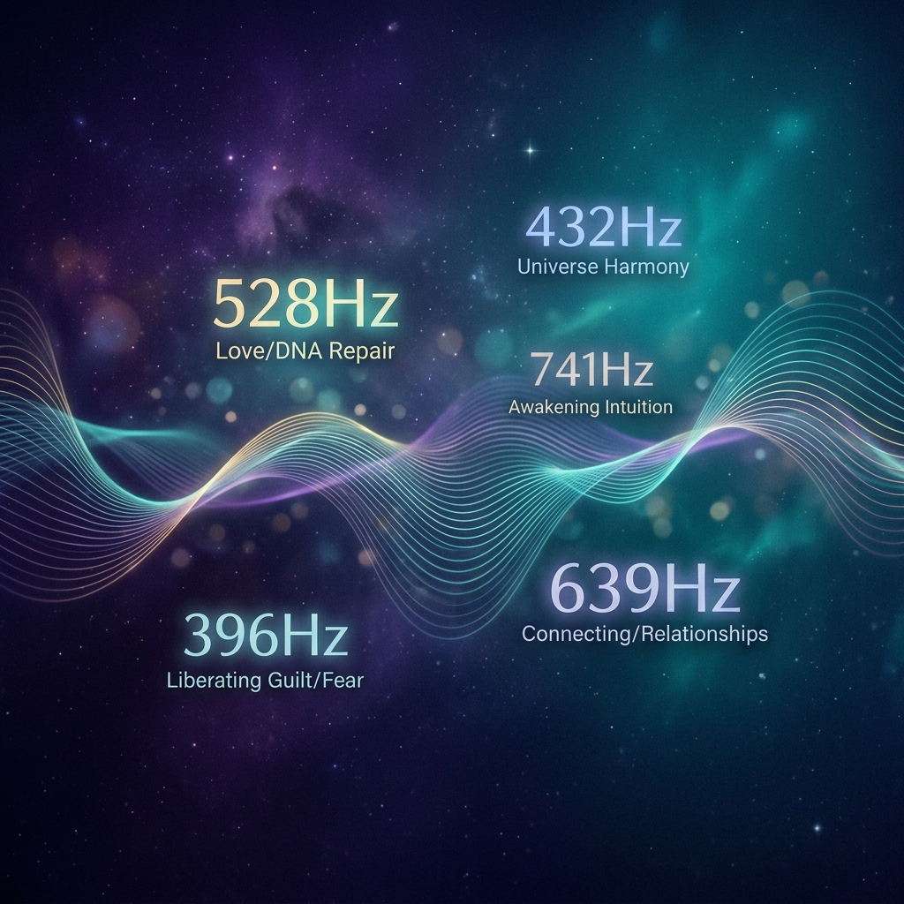

# Frequency Healing Studio

A professional-grade vibrational sound therapy application built with React, TypeScript, and the Web Audio API.

## Overview

Frequency Healing Studio is a digital sanctuary for exploring vibrational sound healing. It provides a comprehensive set of audio synthesis tools designed for meditation, tissue healing, and spiritual alignment.

## Key Features

- **Solfeggio Scale**: Full range of Solfeggio frequencies (174Hz - 963Hz) linked to pain relief, transformation, and intuition.
- **Organ Resonance**: Specific frequencies targeted at biological resonance for organs like the heart, liver, lungs, and brain.
- **Celestial Vibrations**: Harmonic frequencies derived from planetary bodies and the Schumann Resonance.
- **Binaural Generator**: Custom binaural beat builder with selectable carrier frequencies and brain state presets (Gamma, Beta, Alpha, Theta, Delta).
- **Studio Recording**: Record your healing sessions directly in the browser and download as high-quality WAV or MP3 files.
- **Dynamic Swell**: Auto-swelling volume for organic, breathing soundscapes.
- **Keyboard Mapped**: Fully playable via physical keyboard for a professional "studio" feel.

## Tech Stack

- **Core**: React 19, Vite, TypeScript
- **Audio**: Web Audio API (MediaRecorder, OscillatorNode, GainNode, StereoPannerNode)
- **Icons**: Lucide React
- **Styling**: Vanilla CSS with modern aesthetics

## Getting Started

1. Clone the repository
2. Install dependencies: `npm install`
3. Run the development server: `npm run dev`
4. Build for production: `npm run build`

## License

MIT
